---

### About Me

I'm an IT leader with deep roots in large-scale enterprise operations and a hands-on side that never quits. I've managed IT across **325+ distributed locations** for a $5B food enterprise, led infrastructure buildouts from the ground up, and — when I'm not in the boardroom — I'm flashing firmware, writing GPU pipelines, and training models on embedded hardware.

Currently focused on AI, edge AI deployments, distributed systems architecture, and the intersection of operational technology and modern ML infrastructure.

---

### 🏗️ Featured Project

**[dock_&_Production line_scanners](https://github.com/joehudson3/dock_scanner)** — Production line and warehouse dock monitoring system running on NVIDIA Jetson Orin Nano. GStreamer GPU-accelerated camera pipelines supporting barcode scanning and forklift/trailer views in a 24/7 facility environment.

---

### 🛠️ Tech & Tools

  
  
  
  
  
  
  
  

---

### 📊 GitHub Stats

  
  &nbsp;
  

---

### 🐍 Contribution Snake

  <picture>
    <source media="(prefers-color-scheme: dark)" srcset="https://raw.githubusercontent.com/joehudson3/joehudson3/output/snake-dark.svg"/>
    <source media="(prefers-color-scheme: light)" srcset="https://raw.githubusercontent.com/joehudson3/joehudson3/output/snake.svg"/>
    
  </picture>

